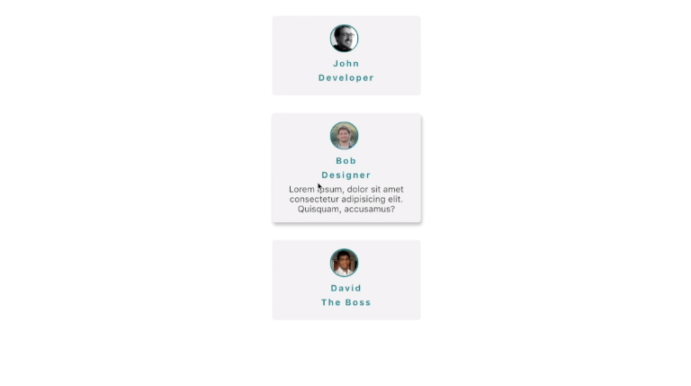

## Learning React by building 5 Projects:

- [X] [Person List](https://github.com/MaxBaranowski/mb-react-learninig/tree/person_list_project)
- [ ] City Tours
- [ ] Todo List
- [ ] Room Search
- [ ] Portfolio

### Person List
Making smth like this

## Code Refactoring

### Goals to achieve

- [X] Rewrite Components/Replace to Component Folder
- [X] Get users info from [Random User Generator](https://randomuser.me/)
- [X] Ajax call for getting basic users info
- [ ] Showing detail user info
- [ ] Ajax call for getting detail user info

### In progress...
